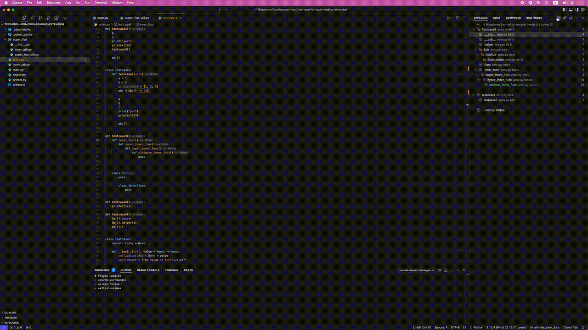
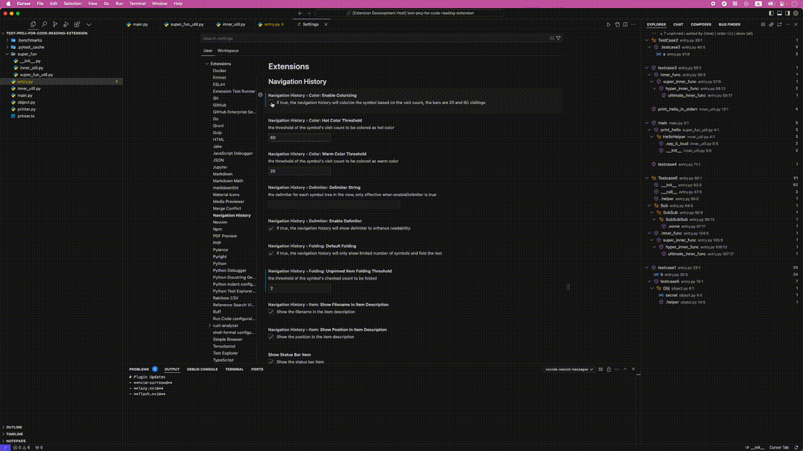

# Navigation History 🧭

## Purpose 🎯

A Visual Studio Code extension designed to enhance the experience of reading code by providing **a comprehensive history of code navigation** and **a tree structure of calling hierarchies**.

## Use Case Scenarios 🔍

When **exploring a new codebase**, developers typically need to understand the overall architecture. This process usually involves:

1. Locating feature entry points to begin code exploration
2. Navigating through calling hierarchies to comprehend implementations

Common challenges during this process include:

1. Difficulty tracking previously visited locations, especially with deep calling hierarchies and scattered entry points
2. Challenges in grasping the codebase's big picture during initial exploration
3. Identifying interesting or complex code sections while reading the code

Thus, this extension is designed to help developers to:

1. Record the history of code navigation, and organize the history as a tree reflecting the calling hierarchy of each symbol
2. Focus on most important symbols, which could be chosen by visit count or manually pinned

## Key Features ⭐

1. 📍 Maintains a comprehensive history of code navigation
2. 🌳 Record the calling hierarchy of each symbol in a tree structure
3. 📊 Tracks symbol visit frequency, highlighting frequently accessed ones
4. 📋 Enables sorting by visit count or chronological order
5. 📌 Allows pinning of important symbols for focused attention

**Calling Hierarchy Visualization**

**Configuration Options**

## How to Install 📦

### From VS Code Marketplace

1. Open the Extensions view by clicking on the Extensions icon in the Activity Bar on the side of the window 
2. Search for "Navigation History" in the search bar.
3. Click on the "Install" button.
4. Once installed, you can activate the extension by clicking on the "Enable" button.

### From GitHub

1. Clone the repository
2. Run `npm install` to install the dependencies
3. Run `npm run compile` to compile the extension
4. Run `npm run package` to package the extension
5. Run `code --install-extension ./navigation-history-1.0.1.vsix` to install the extension

## Comparison with Existing Tools 🔄

### VS Code's "Open Editors" View 📂

I've found that while "Open Editors" is great for managing files, it's not really designed for helping us understand code. In my experience, I end up using the file palette more often when I need to navigate between files.

### [Code Navigation Stack](https://marketplace.visualstudio.com/items?itemName=RoeeBarnea.code-navigation-stack) Extension 🔍

I like this extension for following a single call path, but I've noticed it struggles when I switch between different areas of code. It gets particularly tricky when I'm jumping between classes in the same file or methods within a class.

### VS Code's "Outline" View 📑

We all know this one - it shows us the symbols in our current file and updates when we switch files. I find it works best when I already know my way around the codebase.

### [CodeMap](https://marketplace.visualstudio.com/items?itemName=oleg-shilo.codemap) Extension 🗺️

I appreciate how this extension gives us a clean view of classes and functions, and I love that we can customize how it parses symbols. But similar to the Outline view, I've found it's most helpful once I'm familiar with the code I'm working with.

## Bug Reports 🐛

I'm happy to report everything's working great so far! But if you run into any problems, I'd really appreciate it if you could let me know by opening an issue on our GitHub repository.

## Release Notes 📝

For detailed updates and changes, please refer to [CHANGELOG.md](CHANGELOG.md).

## License 📄

This extension is distributed under the MIT License.

**Happy Code Reading!** 🚀✨
